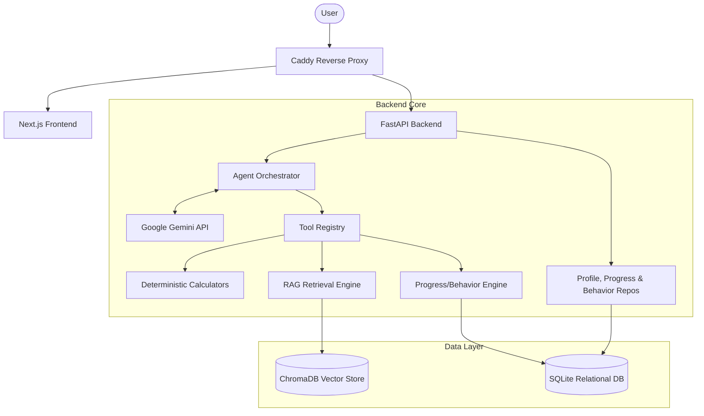

# FitMind AI - Intelligent Personal Fitness Assistant (v1.0.0)

An evidence-based fitness and nutrition intelligence agent, designed to provide personalized, grounded coaching with a focus on reliability, safety, and deterministic calculation.

FitMind is a secure, multi-user system that synthesizes deterministic fitness math, user progress, and a scientific knowledge base into actionable coaching—without the hallucination risks of standard LLMs.

---

## 🛑 Project Status: Feature Frozen (v1.0.0)

FitMind AI has reached **v1.0.0** and is now **feature-frozen**. 
Phases 1 through 17 are completely implemented, evaluated, and documented.
No new product features will be added. The system is hardened, secured, and ready for deployment.

---

## 🏗️ Architecture

## ✨ Capabilities (Phases 1–17)

FitMind has been systematically built through 17 distinct phases, culminating in a robust, production-ready system:

1. **Deterministic Calculation Engine**: Backend-owned math. BMI, BMR, TDEE, and protein targets are calculated deterministically.
2. **RAG Architecture**: Uses embeddings to retrieve facts from a curated knowledge base.
3. **ToolRegistry Framework**: Strict schema boundaries for tool use.
4. **Bounded AgentOrchestrator**: Enforces `MAX_ITERATIONS` and prevents runaway loops.
5. **Multi-User Isolation**: Complete data separation. User A cannot access or query User B's data via API or LLM prompts.
6. **Progress & Behavior Tracking**: Users log daily weight, calories, protein, and workouts.
7. **Adaptive Coaching Dashboard**: "Coach" mode synthesizes profile, metrics, behavior, and RAG knowledge into a unified, interactive Next.js dashboard with Daily Action Plans.
8. **Citation Validation**: Bounded hallucinations via post-generation evidence filtering.
9. **Security & AI Safety Guardrails**: Strict refusal of medical diagnoses, dietary prescriptions for acute illness, and prompt injection mitigations.
10. **Production Docker Deployment**: Fully containerized stack with a Caddy reverse proxy for local automatic HTTPS and easy VPS deployment.

---

## 📊 Evaluation & Metrics

FitMind is continuously evaluated against a rigorous baseline.

**Current Test Coverage**:
- **Backend**: 148 automated tests (Pytest) - 100% Core Coverage
- **Frontend**: 27 UI and interaction tests (Jest) + Playwright E2E

---

## 💻 Tech Stack

- **Backend**: Python 3.13 (uv), FastAPI, Pydantic, Pytest, SQLite
- **AI/ML**: Google Gemini API, ChromaDB
- **Frontend**: Node.js 20, Next.js 14, TypeScript, Tailwind CSS
- **Infrastructure**: Docker, Docker Compose, Caddy

---

## 🚀 Deployment

For production deployment instructions, please see [docs/DEPLOYMENT.md](docs/DEPLOYMENT.md).

For local development setup, refer to standard `uv run` and `npm run dev` workflows inside the respective directories.
