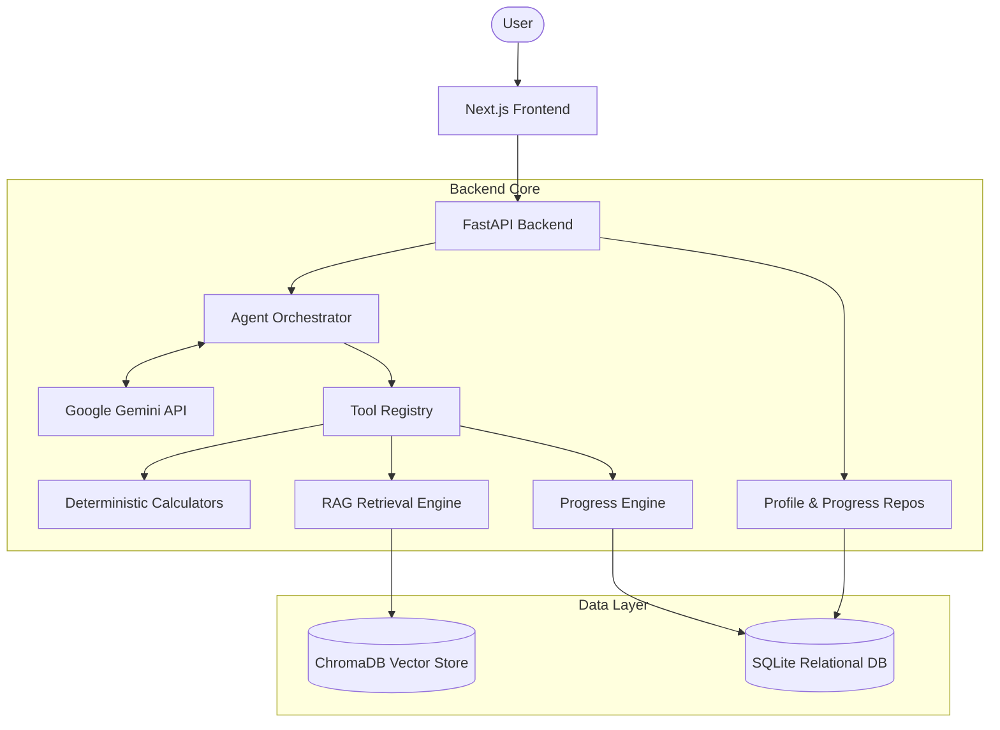

# FitMind AI

An evidence-based fitness and nutrition intelligence agent, designed to provide personalized, grounded coaching with a focus on reliability and safety. 

FitMind is a local-first, single-user system that synthesizes deterministic fitness math, user progress, and a scientific knowledge base into actionable coaching—without the hallucination risks of standard LLMs.

---

## 🏗️ Architecture



## ✨ Capabilities (Phases 1–11)

FitMind has been systematically built through 11 distinct phases, ensuring rigorous safety and determinism:

1. **Deterministic Calculation Engine**: Backend-owned math. BMI, BMR (Mifflin-St Jeor), TDEE, and protein targets are calculated deterministically. The LLM is strictly prohibited from doing fitness math.
2. **RAG Architecture (Retrieval-Augmented Generation)**: Uses `all-MiniLM-L6-v2` embeddings in ChromaDB to retrieve facts from a curated JSON knowledge base.
3. **ToolRegistry Framework**: The agent interacts with tools (calculators, progress lookup, knowledge search) through a securely bounded registry with strict schemas.
4. **Bounded AgentOrchestrator**: The core agent loop enforces `MAX_ITERATIONS` and tool retry limits to prevent infinite loops and runaway token usage.
5. **Personalized Fitness Profiles**: Users maintain an authoritative, immutable fitness profile (stored in SQLite) that is automatically injected into the agent's context.
6. **Progress & Weight History**: Users log weight over time. The backend deterministically calculates trends, ensuring the LLM does not hallucinate historical progress or make unsupported future predictions.
7. **Adaptive Coaching Engine**: A dual-mode orchestration system. "Coach" mode proactively synthesizes the user's profile, deterministic metrics, and RAG knowledge into structured, personalized recommendations.
8. **Citation & Grounding Validation**: A strict post-generation filter. If the model claims to use a knowledge document in its recommendations (via `evidence_ids`) but did not retrieve it, the orchestrator intercepts and blocks the hallucination with a `CITATION_VALIDATION_FAILED` error.
9. **Security & Adversarial Defenses**: Guardrails against prompt injections, strict refusal of medical diagnoses, and systematic filtering of `test_only` benchmark documents from the production retrieval path.

---

## 📊 Evaluation & Metrics

FitMind is continuously evaluated against a rigorous baseline.

**Current Test Coverage**:
- **Backend**: 123 automated tests (Pytest)
- **Frontend**: 21 UI and interaction tests (Jest/React Testing Library)

**Retrieval Performance (50-Question Benchmark)**:
- **Top-1 Retrieval Accuracy**: 85.7%
- **Recall@5**: 87.1%

**Performance Baseline**:
- **RAG Search Latency**: ~1.62s average
- **Agent Orchestration Latency**: ~2.97s average

---

## ⚠️ Current Limitations & Constraints

Please note the following intentional architectural constraints:

- **Local/Single-User Only**: There is currently no multi-tenant authentication or authorization.
- **Persistence**: Relies on a local SQLite database and local ChromaDB directory.
- **LLM Dependency**: Dependent on the Google Gemini API (and subject to its rate limits). Behavior remains probabilistic despite strong orchestrator guardrails.
- **No Medical Advice**: The system is strictly sandboxed from providing medical diagnoses or individualized medical treatment.
- **Infrastructure**: Cloud deployment, containerization, and production infrastructure are currently out of scope.

---

## 💻 Tech Stack

- **Backend**: Python 3.11+, FastAPI, Pydantic, Pytest
- **AI/ML**: Google Gemini API, ChromaDB, SentenceTransformers
- **Frontend**: Node.js 18+, Next.js 14, TypeScript, Tailwind CSS
- **Database**: SQLite

---

## 🚀 Local Setup

### 1. Clone the repository
```bash
git clone <your-repo-url>
cd "Fitmind AI"
```

### 2. Environment Variables
You must provide a Gemini API key.

```bash
# In the backend directory
cp .env.example .env
# Edit .env and set GEMINI_API_KEY=your_key_here

# In the frontend directory
echo "NEXT_PUBLIC_API_URL=http://localhost:8000" > .env.local
```

### 3. Backend Setup
```bash
cd backend
python -m venv .venv

# Activate (Windows)
.\.venv\Scripts\Activate.ps1
# Activate (macOS/Linux)
# source .venv/bin/activate

pip install -e ".[dev]"
uvicorn app.main:app --reload
```

### 4. Frontend Setup
```bash
cd frontend
npm install
npm run dev
```

The frontend will be running at **http://localhost:3000** and the API at **http://localhost:8000**.

---

## 🗺️ Roadmap

- **Phase 12: Behavioral Fitness Tracking** (Next up!)
- **Phase 13+**: TBD
